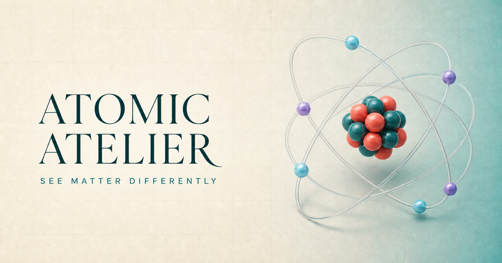

# Atomic Atelier

Atomic Atelier is an interactive chemistry learning app for exploring all 118 elements through 3D teaching models, periodic trends, quizzes, and comparisons. It also includes a guided reaction lab where students can balance 12 foundational equations and watch atoms rearrange.



## Features

- Explore all 118 elements with searchable and filterable element data.
- Inspect simplified, interactive 3D atomic models built with Three.js.
- Compare element properties and periodic trends side by side.
- Browse a keyboard-accessible periodic table.
- Test element knowledge with deterministic quizzes.
- Balance 12 guided chemical equations, visualize atom conservation, and receive technique grades with strategy feedback.
- Follow a short first-visit orientation and continue from a local progress dashboard.
- Save favorites, explored elements, quiz scores, reaction grades, and recent activity locally.
- Install the app and revisit the element explorer or reaction lab offline.
- Use the responsive interface on desktop and mobile, with reduced-motion support.


## Element data

The app reads from the committed snapshot in `app/data/elements.json`, so neither the browser nor the production build requires a runtime chemistry API.

`npm run data:sync` refreshes the snapshot from PubChem periodic-table and PUG-View records. The script derives shell occupancy, selects representative isotopes when supported by abundance data, normalizes nullable properties, attaches PubChem, IUPAC, and NIST references, and validates the generated records. Changes to names, standard atomic weights, or other evaluated properties should still be checked against the linked authoritative sources before committing a refreshed snapshot.

## Persistence and privacy

Progress is stored only in the browser under the `atomic-atelier:v1` local-storage key. The app has no accounts, analytics payload, database, cloud synchronization, notes, or collection of personally identifiable information.

Stored preferences include favorites, explored and recent elements, quiz scores, completed reactions, reaction technique grades, last selections, and the auto-rotate setting. If browser storage is missing, blocked, outdated, or malformed, the app falls back to safe defaults.

## Offline installation

The App Router manifest and production service worker make Atomic Atelier installable. The service worker precaches the two application routes, their generated Next.js assets, and the application icons. Same-origin navigations use a network-first strategy with cached route fallbacks, while hashed static assets use cache-first delivery. Service-worker registration is production-only so local development always reflects current code.

## Teaching-model limitations

Atomic shell paths, particle spacing, relative scale, and reaction geometry are intentionally simplified for teaching. The reaction animations demonstrate conservation of atom identities and schematic bond rearrangement; they are not quantum-orbital, kinetic, or reaction-mechanism simulations.

Safety notes are conceptual. Atomic Atelier does not provide experimental quantities or laboratory procedures.

## Project structure

```text
app/
├── components/          Interactive explorer and reaction UI
├── data/elements.json   Committed data for all 118 elements
├── lib/                 Chemistry, formula, and progress utilities
├── reactions/           Guided reaction-lab route
├── layout.tsx           Global metadata, fonts, and page shell
└── page.tsx             Element-explorer route
public/                  Icons and social-preview assets
scripts/                 Element-data synchronization
test/                    Unit, end-to-end, and visual tests
```

## Tech stack

- [Next.js 16](https://nextjs.org/) and React 19
- TypeScript
- Three.js for atomic models
- GSAP for interface motion
- Tailwind CSS 4/PostCSS
- Vitest and Testing Library for unit tests
- Playwright for end-to-end and visual tests
